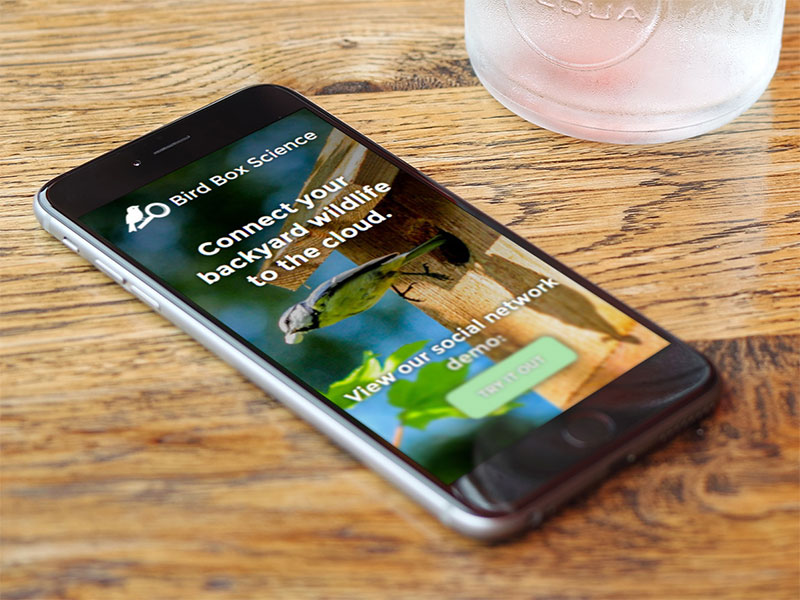

# Bird Box Science

Bird Box Science was designed and created in two days for Bellevue Startup Weekend 2014, as a static mock-up of a social network page and product landing page. The product vision and team took first place, and the majority of them went on to develop the concept into a Kickstarter.

## Other credits

Chart and graph logic is credited to my team member, Frank S. Zhang. The logo design is credited to Rose Beede. The concept and name belongs to our team leader, Doug Bonham.

## Disclaimer

As live sites are guaranteed to change over time (whether they get redesigned or shut down), I have preserved a static copy of the original design & code for preview purposes. Please note that this is therefore an archive, and does not necessarily represent my latest skillset.
