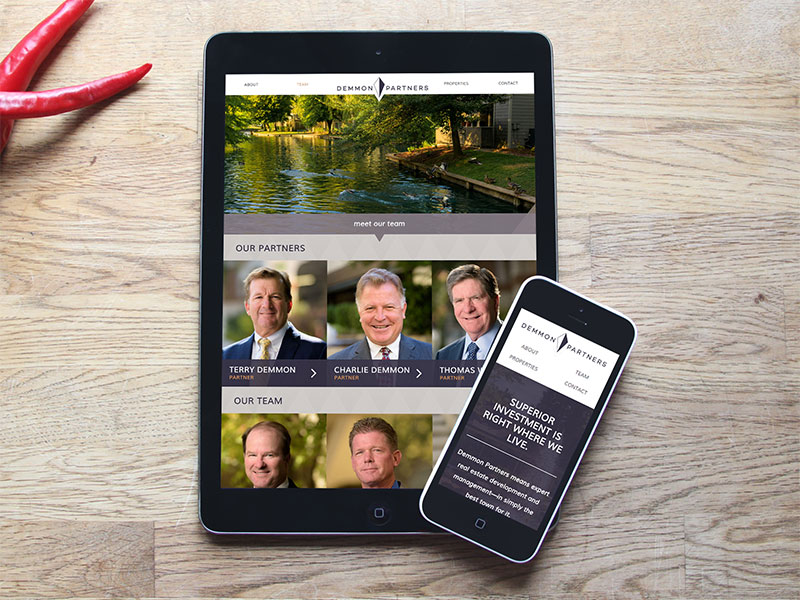

# Demmon Partners

A marketing website for a real estate company based in California, featuring expandable team biographies and beautiful imagery. I handled the PSD to HTML conversion, and handed off the static assets to another developer to convert into a WordPress theme.

## Disclaimer

As live sites are guaranteed to change over time (whether they get redesigned or shut down), I have preserved a static copy of the original design & code for preview purposes. Please note that this is therefore an archive, and does not necessarily represent my latest skillset.
