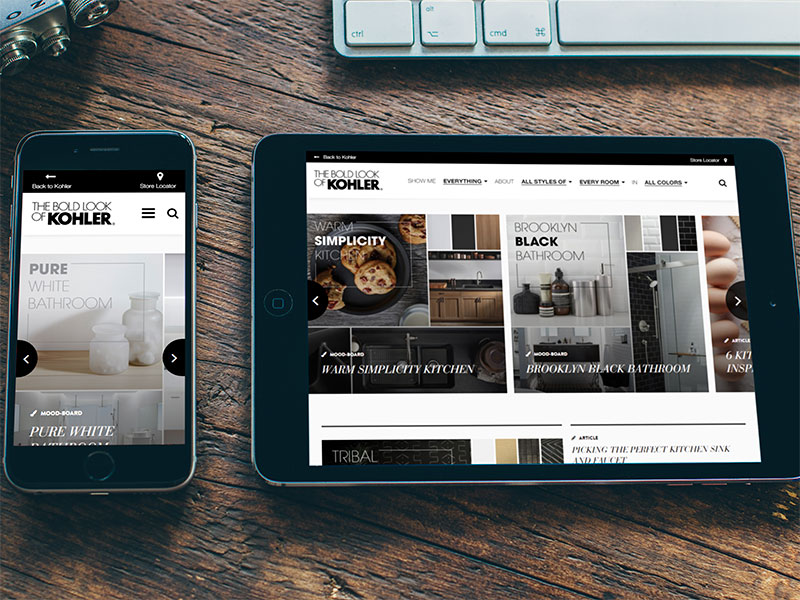

# The Bold Look of Kohler

An image-centric inspiration blog for Kohler, Wisconsin-based interior manufacturing brand. Features masonry moodboards, articles, and image carousels. I'm very proud of this particular site, which was one of my first projects at Tidal where I owned both the front-end and back-end development.

I built out the site on our custom PHP/MongoDB CMS, implemented lightbox and carousel plugins, and wrote custom Javascript to interface with the faceted search navigation.

## Disclaimer

(Static site / code samples are currently being polished and will be uploaded soon. Stay tuned!)

As live sites are guaranteed to change over time (whether they get redesigned or shut down), I have preserved a static copy of the original design & code for preview purposes. Please note that this is therefore an archive, and does not necessarily represent my latest skillset.
