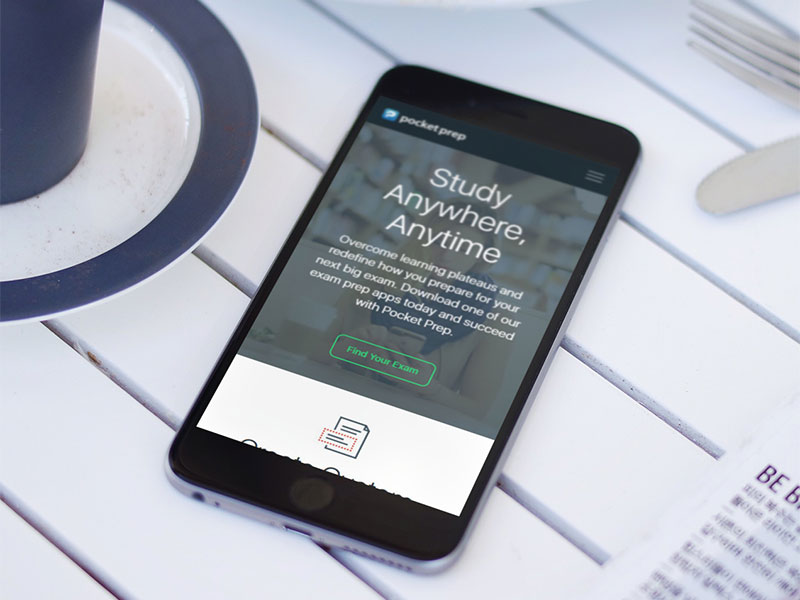

# Pocket Prep

Pocket Prep was a delightful website redesign for an app company based in Seattle. I was able to fully own the development of the site, from static HTML to WordPress template, as well as work directly with the client throughout the process.

I was particularly proud of this project due to this sense of ownership and the client's praise for the final product's polish and ease of use in the admin dashboard. I also greatly enjoyed learning about and implementing custom post types, advanced custom fields and repeaters, and the MixItUp jQuery library.

## Disclaimer

(Static site / code samples are currently being polished and will be uploaded soon. Stay tuned!)

As live sites are guaranteed to change over time (whether they get redesigned or shut down), I have preserved a static copy of the original design & code for preview purposes. Please note that this is therefore an archive, and does not necessarily represent my latest skillset.
