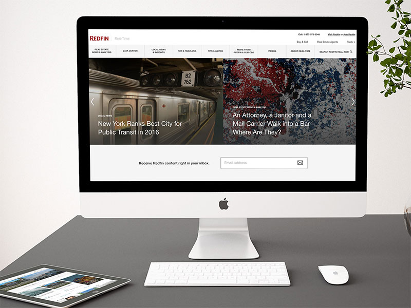

# Redfin Real-Time

Our agency had the pleasure of working with Redfin to redesign, modernize, and consolidate their blog. My main responsibility was the initial PSD to HTML conversion and handing assets off to another developer to convert into a WordPress theme. I also continued to assist with WordPress data migration and troubleshooting server issues after.

## Disclaimer

(Static site / code samples are currently being polished and will be uploaded soon. Stay tuned!)

As live sites are guaranteed to change over time (whether they get redesigned or shut down), I have preserved a static copy of the original design & code for preview purposes. Please note that this is therefore an archive, and does not necessarily represent my latest skillset.
