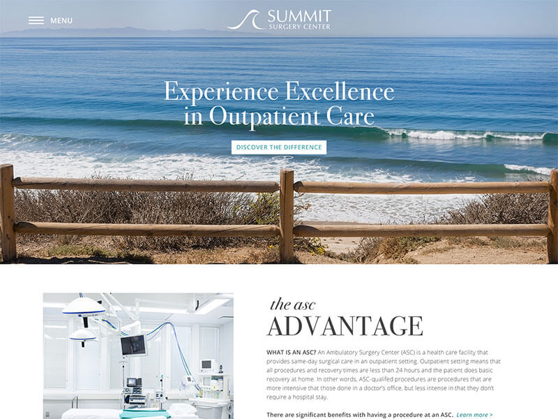

# Summit Surgery Center

Summit Surgery Center was a project featuring a beautiful website redesign for an outpatient surgery in Santa Barbara. I was responsible for converting the design into responsive code (with all included JS functionality), and handing off the assets to another developer to be turned into a WordPress template.

Note: At the developer's specific request, I utilized more element tags and fewer BEM classes in my CSS for this project.

## Disclaimer

As live sites are guaranteed to change over time (whether they get redesigned or shut down), I have preserved a static copy of the original design & code for preview purposes. Please note that this is therefore an archive, and does not necessarily represent my latest skillset.
