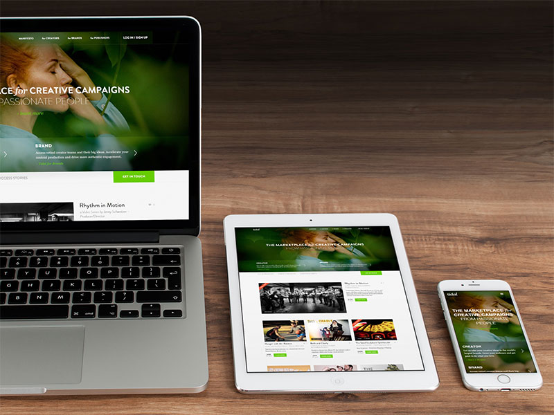

# Tidal

Home of Tidal Labs, a digital marketing company I was proud to work at. Initially, our team built out a full web app with marketplace/user logic, but eventually transitioned over to a more traditional landing site.

I oversaw the Tidal site through multiple redesigns and revisions. Primarily I owned the front-end stack, wrote our CSS style guide, and provided input for UI/UX decisions - all while learning PHP/Laravel, making contributing to the back-end, and collaborating with both designers and marketing content producers.

## Disclaimer

(Static site / code samples are currently being polished and will be uploaded soon. Stay tuned!)

As live sites are guaranteed to change over time (whether they get redesigned or shut down), I have preserved a static copy of the original design & code for preview purposes. Please note that this is therefore an archive, and does not necessarily represent my latest skillset.
